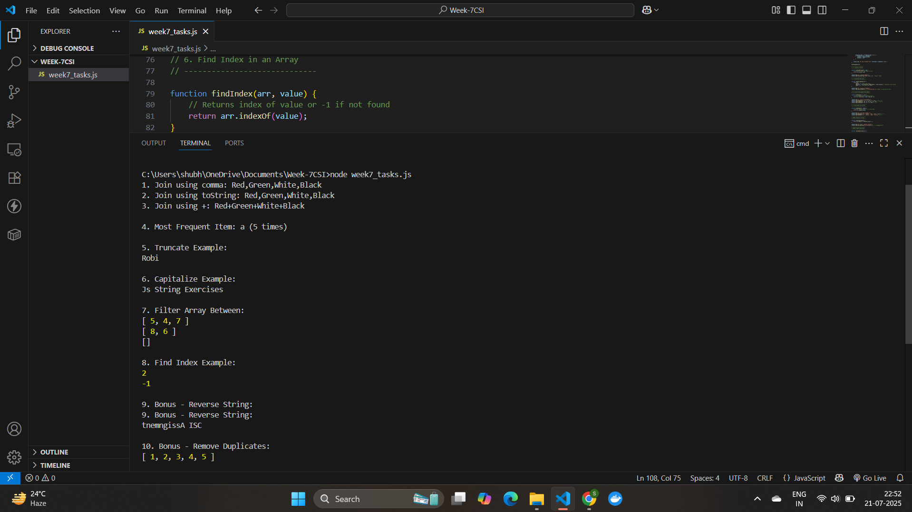

# CSI Week 7 – JavaScript Assignment

👨‍💻 **Submitted by:** Shubhanjali Pandey  
📁 **File Name:** `week7_tasks.js`  
🖼 **Screenshot:** `screenshot7.png` (attached)

---

## 📚 Description:

This assignment includes multiple JavaScript programs focusing on array and string operations. The tasks are based on CSI Week 7 topics and are implemented using clean and readable JS code.

All programs are tested in Node.js, and output has been captured in the attached screenshot.

---

## ✅ Tasks Covered:

1. **Join Elements of an Array**  
   - Using `.join()`, `.toString()`, and custom separators.

2. **Most Frequent Item in an Array**  
   - Identifies the item with the highest frequency.

3. **Truncate a String**  
   - Cuts string to a specified number of characters.

4. **Capitalize Each Word in a String**  
   - Capitalizes the first letter of every word.

5. **Filter Values Between Two Numbers**  
   - Returns values that fall strictly between two limits.

6. **Find Index of an Item in Array**  
   - Uses `.indexOf()` to return the position of an element.

7. **BONUS: Reverse a String**  
   - Reverses characters in a string.

8. **BONUS: Remove Duplicates from Array**  
   - Uses `Set` to return only unique elements.

---
## 📸 Output Screenshot

The full output from running the code is shown in the screenshot below:

## Acknowledgement

I would like to express my sincere gratitude to Celebal technologies for providing us with the opportunity to explore practical applications of JavaScript in Week 7. This assignment helped me strengthen my understanding of string manipulation, array methods, and core programming logic.

I also thank the CSI team for their continuous support, guidance, and engaging curriculum that encourages hands-on learning and real-world problem solving.

— Shubhanjali Pandey (App. Mod intern)

